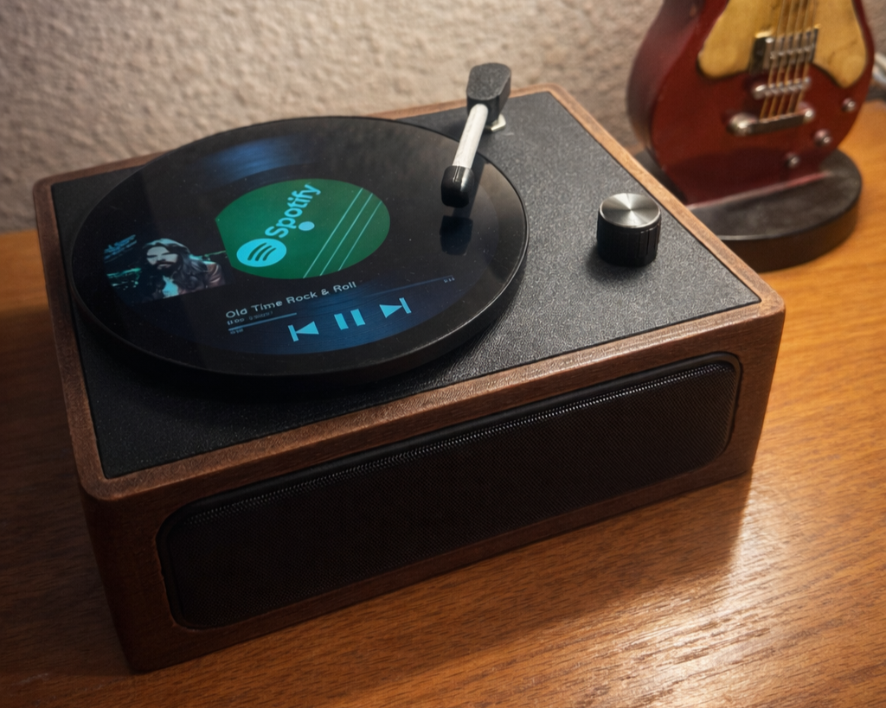

# Digital Vinyl Player

This is a Raspberry Pi–based Spotify player designed to look and behave like a physical vinyl record player.

I built this as a personal engineering project and kept refining it until it reached a point where it felt solid, reliable, and like a finished product. It boots straight into a custom vinyl-style UI, plays Spotify in the background, and is controlled using real hardware (needle, buttons, volume knob).

This isn’t meant to feel like a computer — it’s meant to feel like a vinyl record player.

---

## What it does

- Runs Spotify using Chromium (I tried other methods, this ended up being the most reliable)
- Displays a custom round “vinyl record” UI that can be switched with a button press
- Uses physical controls via an Arduino Nano
- Supports a round touchscreen
- Includes a built-in Wi-Fi + Spotify login setup mode  
  (no keyboard, mouse, or SSH needed)
- Automatically recovers if Chromium starts using too much memory
- Starts and runs without a keyboard, mouse, or phone

Once it’s set up, you can power it on and listen to your favorite music.

---

## How it works

1. The Pi boots into the graphical session  
2. Spotify starts in the background (Chromium)  
3. The vinyl UI starts and stays on top  
4. Physical controls interact with Spotify  
5. A watchdog monitors Chromium memory and restarts it if needed  

---

## Setup mode

Setup mode is only used when Wi-Fi or Spotify login is needed.

- Opens a local Wi-Fi setup page
- Opens Spotify’s login page
- Uses an on-screen keyboard for touch input
- Temporarily disables the vinyl UI so setup windows stay visible
- Restores normal mode when finished

Setup mode can be triggered by holding the physical **back button** for 7+ seconds.

---

## Hardware

- Raspberry Pi (tested on Pi 5)
- Round 1080×1080 touchscreen
- Arduino Nano (needle position, buttons, volume)
- External USB speaker

---

## Software

- Raspberry Pi OS (X11 / LXDE)
- Chromium (Spotify Web Player)
- Python (UI + hardware control)
- Flask (Wi-Fi setup interface)
- systemd user services
- nmcli for network management
- Onboard for on-screen keyboard

---

## Reliability

This project is designed to run unattended.

A systemd watchdog monitors Chromium’s memory usage. If it grows too large for too long, Spotify is restarted automatically with a cooldown to prevent restart loops. This keeps the system responsive without needing a reboot.

---

## Project structure

