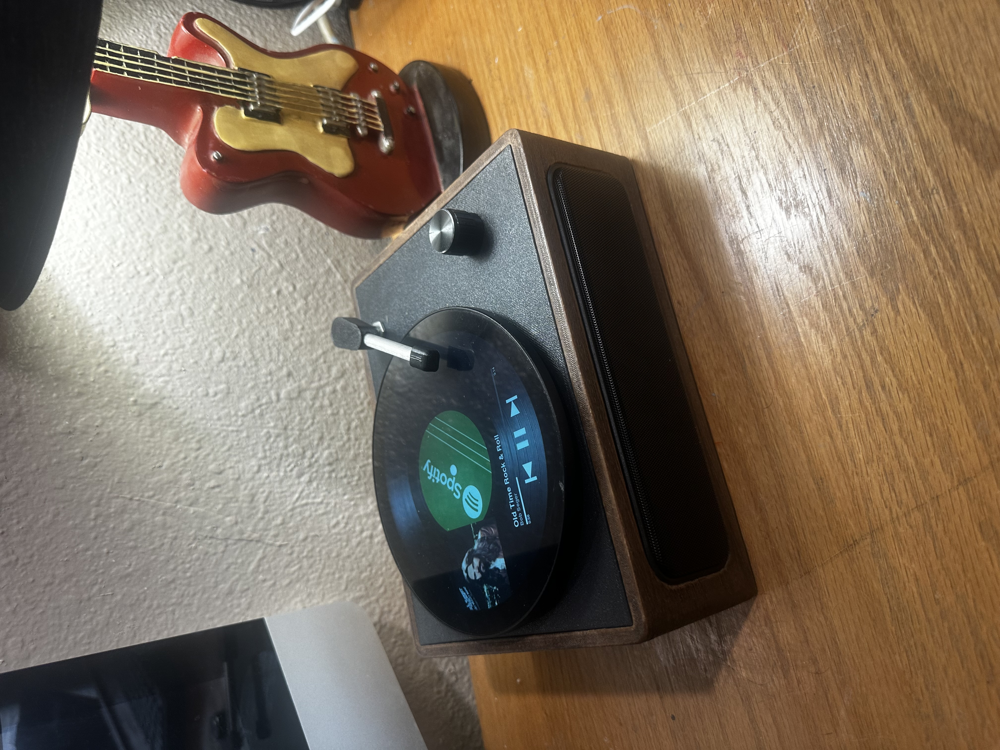

# Digital Vinyl Spotify Player

A Raspberry Pi–based Spotify player that behaves like a real vinyl record player.

## Features
- Spotify Web Player (Chromium)
- Always-on-top Vinyl UI overlay
- Physical needle control (play / pause)
- Physical volume knob (Chromium stream volume)
- Touch UI controls
- Auto-start on boot
- No phone required after setup

## Hardware
- Raspberry Pi 5
- Touchscreen display
- USB speakers or DAC
- Arduino Nano (needle + volume)

## Software Stack
- Raspberry Pi OS (Desktop, X11)
- Chromium (Spotify Web Player)
- PipeWire / WirePlumber
- Python (pygame)
- playerctl / wpctl
- systemd user services

## Project Structure

## Installation (summary)
1. Flash Raspberry Pi OS
2. Install dependencies
3. Copy scripts and services
4. Enable systemd user services
5. Login to Spotify once

(Full step-by-step guide coming next.)

## License
Personal / educational use (update as needed)
