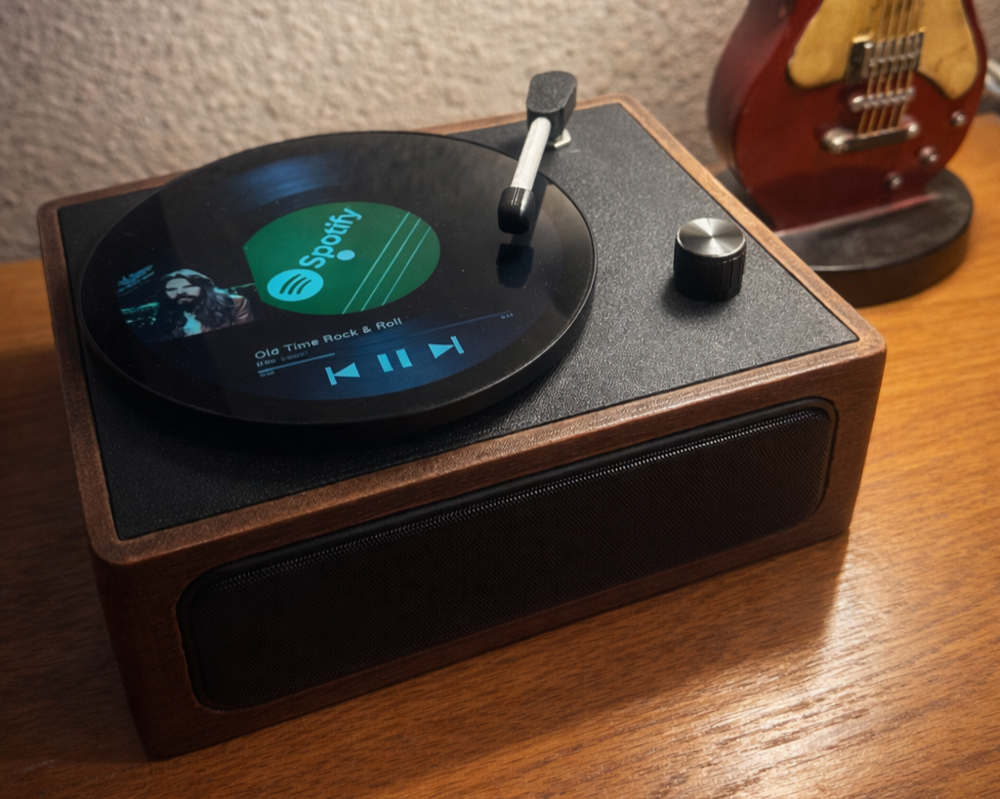

# Digital Vinyl Player

This project is a Raspberry Pi-only rebuild of the prototype digital vinyl player.

The active codebase is now organized around:

- `src/` for the Python runtime and UI
- `assets/` for UI artwork and vinyl skins
- `bin/` for startup, calibration, and helper scripts
- `docs/` for setup and project notes
- `systemd/user/` for user services
- `archive/` for older prototype code kept for reference

## Documentation

- Project overview: [`docs/README.md`](docs/README.md)
- Install guide: [`docs/INSTALL.md`](docs/INSTALL.md)

## Highlights

- Chromium kiosk support for a browser-based music provider
- Pygame vinyl UI for the round display
- AS5600 tonearm sensing over I2C
- GPIO rotary encoder volume control
- GPIO 22 back/setup button handling
- Local setup portal for Wi-Fi and provider sign-in

Old Pico, Nano, and install experiments are still preserved under `archive/`.
